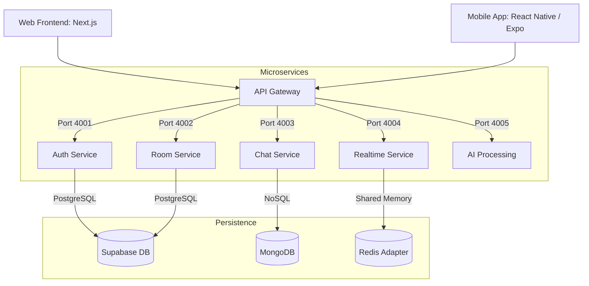

# GhostRoom 👻 — The Infinite Private Meeting Engine

**GhostRoom** is a high-performance, privacy-first virtual collaboration platform available on **Web & Mobile (iOS/Android)**. It combines real-time WebRTC video, end-to-end encrypted messaging, and browser-native AI to create a "zero-trust" meeting environment.


---

## 🚀 Vision & Innovation

GhostRoom is built to solve the "Privacy vs. Performance" trade-off. 
-   **No Background Leakage**: Your video background is processed LOCALLY using MediaPipe AI—it never leaves your computer.
-   **Zero-Knowledge Storage**: Chat messages and files are encrypted with **AES-GCM (Room Key)** before being sent to the database.
-   **Smart Layouts**: Intelligent "Stage View" with pinning, designed for modern remote work.

---

## 📁 System Architecture

GhostRoom uses a **Decoupled Microservices Architecture** to ensure high availability and horizontal scaling.



### 🛰️ Service Ecosystem Breakdown

1.  **API Gateway (Port 4000)**: 
    - acts as the single entry point. 
    - Handles request routing and cross-service proxying to avoid CORS issues.
2.  **Auth Service (Port 4001)**: 
    - Manages user authentication via **JWT (HS256)**.
    - Syncs user profiles with **Supabase Auth**.
3.  **Room Service (Port 4002)**: 
    - The "Brain" of the operation.
    - Handles room creation, **Cryptographic Token** generation, and secure membership validation.
4.  **Chat Service (Port 4003)**:
    - High-velocity messaging optimized with **MongoDB**.
    - Handles message persistence and history retrieval.
5.  **Realtime Service (Port 4004)**:
    - Built on **Socket.io**.
    - Manages the **WebRTC Mesh Signaling** path for P2P video/audio.
6.  **AI Engine (Port 4005)**:
    - Specialized service for handling AI model configurations and browser-side video enhancement logic.

---

## 🛠️ Performance Features

### 1. **Neural AI Video Engine (Local)**
Uses **MediaPipe Selfie Segmentation** with a custom Canvas Compositing pipeline.
-   **Blur Mode**: 15ms Gaussian blur via offscreen canvas.
-   **Office/Nature Modes**: High-res segmentation with zero GPU latency.
-   **Studio Mode**: Dynamic lighting adjustments in-browser.

### 2. **Mesh-Signaling WebRTC**
-   **Mesh Architecture**: P2P connections between all participants for <100ms latency.
-   **Socket.io PubSub**: Real-time participant discovery and "Room Users" synchronization.

### 3. **Smart Join Link Parsing**
-   **Smart Link Utility**: Users can paste an entire invite URL, and the system extracts the `RoomID` and `Secret Token` automatically.
-   **UUID Security**: All Room IDs are 128-bit random UUIDs, making them unguessable.

---

## 🔒 Security Hardening

-   **Admin-Only Moderation**: Only room owners can grant entry.
-   **Cryptographic Tokens**: Every room generates a unique `access_token` required for the first join.
-   **Database RLS**: Supabase Row-Level Security ensures users can only see rooms they belong to.
-   **Service Isolation**: Internal microservices are hidden behind a single-point Gateway.

---

## 📱 Mobile App (React Native / Expo)

GhostRoom ships with a **cross-platform mobile app** built with React Native (Expo Router), reusing the same backend microservices.

### Tech Stack
| Layer | Technology |
|---|---|
| Framework | React Native (Expo SDK 55) |
| Navigation | Expo Router (file-based) |
| State | React Context + AsyncStorage |
| Realtime | Socket.IO Client |
| Styling | StyleSheet (Obsidian/Emerald theme) |

### Screens
- **Auth** — Login/Signup with GhostRoom branding
- **Dashboard** — Room list with pull-to-refresh
- **Create** — Initialize new encrypted chambers
- **Join** — Smart paste: accepts invite links or Room IDs
- **Room** — Real-time encrypted chat with participant tracking
- **Profile** — User avatar, info, and session disconnect
- **Deep Link Join** — `ghostroom://join/{token}` auto-joins a room

### Running the Mobile App
```bash
cd mobile
npm install
npx expo start
```
Scan the QR code with **Expo Go** (iOS/Android) or press `w` for web.

> **Note**: Update `API_BASE_URL` in `mobile/constants/Colors.ts` with your Mac's LAN IP for device testing.

---

## ⚙️ Quick Start (Developer Mode)

### Step 1: Install All Dependencies
One-click install for the entire monorepo:
```bash
npm run install:all
```

### Step 2: Database Setup
Run the `supabase_schema.sql` in your Supabase SQL Editor. This initializes:
- User Profiles & Avatars
- Room Metadata & Secure Tokens
- Membership RLS Policies

### Step 3: Launch
Start all 5 microservices + the Gateway + Next.js:
```bash
npm run dev:all
```

Visit **`http://localhost:1000`** to enter the GhostRoom. 🚀

---

## 📈 Roadmap
- [x] **Mobile App**: Cross-platform React Native app with Expo.
- [x] **Direct Invite Links**: One-click join via `/join/{token}` deep links.
- [ ] **WebRTC on Mobile**: Full video calling inside the mobile app.
- [ ] **SFU Upgrade**: Transition from Mesh to SFU (Selective Forwarding Unit) for 50+ meetings.
- [ ] **Recording Engine**: Local stream recording to E2EE storage.
- [ ] **Synchronized Media**: Watch movies & listen to music together in-room.

---

*Built with ❤️ by the Ritu Raj.*
